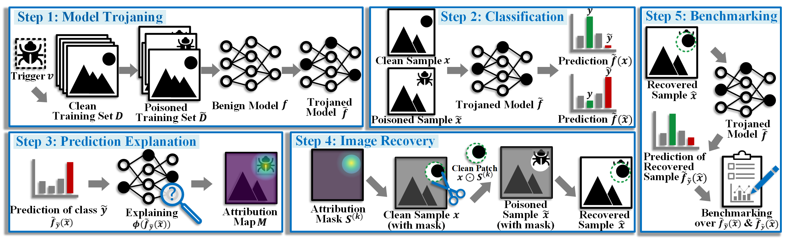

# Backdoor-based Explainable AI Benchmark for High Fidelity Evaluation of Attribution Methods

This code implements an input marginal density regulariation from the following paper:

> Peiyu Yang, Naveed Akhtar, Jiantong Jiang, and Ajmal Mian
>
> [Backdoor-based Explainable AI Benchmark for High Fidelity Evaluation of Attribution Methods](https://arxiv.org/abs/2405.02344)


## Introduction
Attribution methods compute importance scores for input features to explain the output predictions of deep models. However, accurate assessment of attribution methods is challenged by the lack of benchmark fidelity for attributing model predictions. Moreover, other confounding factors in attribution estimation, including the setup choices of post-processing techniques and explained model predictions, further compromise the reliability of the evaluation. In this work, we first identify a set of fidelity criteria that reliable benchmarks for attribution methods are expected to fulfill, thereby facilitating a systematic assessment of attribution benchmarks. Next, we introduce a Backdoor-based eXplainable AI benchmark (BackX) that adheres to the desired fidelity criteria. We theoretically establish the superiority of our approach over the existing benchmarks for well-founded attribution evaluation. With extensive analysis, we also identify a setup for a consistent and fair benchmarking of attribution methods across different underlying methodologies. This setup is ultimately employed for a comprehensive comparison of existing methods using our BackX benchmark. Finally, our analysis also provides guidance for defending against backdoor attacks with the help of attribution methods.



## Backdoored Model Training (E.g., On CIFAR-10)

### Step 1: Create poisoned set.
```
python -u create_poisoned_set.py -dataset "cifar10" -poison_type "blend" -poison_rate 0.05 -alpha 0.5 -trigger "firefox_corner_32.png"
```

### Step 2: Create clean set.
```
python -u create_clean_set.py -dataset "cifar10"
```

### Step 3: Model Training on poisoned set.
```
python -u train_on_poisoned_set.py -dataset "cifar10" -poison_type "blend" -poison_rate 0.05 -alpha 0.5 -trigger "firefox_corner_32.png"
```


## Bibtex
If you found this work helpful for your research, please cite the following papers:
```
@artical{yang2024backx,
    title={Backdoor-based Explainable AI Benchmark for High Fidelity Evaluation of Attribution Methods},
    author={Peiyu Yang and Naveed Akhtar and Mubarak Shah and Ajmal Mian},
    booktitle={CoRR},
    year={2024}
}
```
